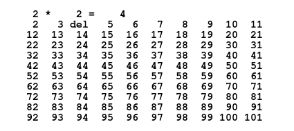

Sieve of Eratosthenes
=====================

Find all prime numbers between 2 and _n_.

## Algorithm

The gist of the algorithm is as follows.

1. List all integers from 2 to _n_.
1. Cross out all multiples of 2 greater than 2.
1. Let _i_ be the next number not already crossed out. Cross out all multiples of  _i_.
1. Repeat previous step while _i_ &le; &Sqrt;_n_.
1. Collect the remaining uncrossed-out numbers. They are prime.

The code doesn't strictly follow this since there are some well-known tweaks to
squeeze a little extra time and space efficiency.

1. Instead of crossing out all multiples of _i_, we only cross out all _i_
   &times; _j_ where _i_ &le; _j_ and _i_ &times; _j_ &le; _n_.
1. We start the algorithm at 3 instead of 2 and thereby allocate half the space
   in our initial list as well as skip step 2 in the original algorithm.
1. We use addition and bit operations instead of multiply/divide/modulus. The
   compiler will do these optimizations on its own if we set the `-O2` flag, but
   it's still fun to do as an exercise :D

### Reference

Goodaire EG, Parmenter, MM.
**Discrete Mathematics with Graph Theory**, 3rd Ed.
ISBN&nbsp;0&#8209;13&#8209;167995&#8209;3.
p. 116.
